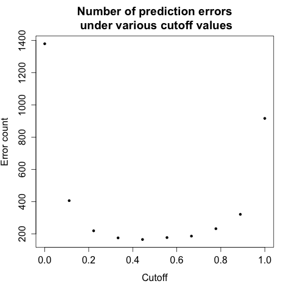

<h1>Building a Spam Prediction Model</h1>

<h2>Objective</h2>
<strong>Objective:</strong> Builld a prediction model that can predict with high accuracy whether an email is spam or non-spam.

<h2>About the Data</h2>
The <strong>'spam' data</strong> inside <strong>'kernlab' package</strong> in R contains 4601 rows of emails classified as spam or non-spam. In addition to this classification label, there are 57 variables (as columns of the dataset) indicating the frequency of certain words and characters in each email.

Cran package URL: <a href='http://cran.r-project.org/web/packages/kernlab/index.html' target='_blank'>http://cran.r-project.org/web/packages/kernlab/index.html</a>

<h2>Model Building Process</h2>
<strong>Note:</strong> More detailed information on these procedures can be found in the comments throughout the script file, <a href='./spamPrediction.R' target='_blank'>spamPrediction.R</a>.

<h3>1. Download the kernlab package and load the spam data</h3>

    > install.packages('kernlab')
    > library(kernlab)
    > data(spam)
    > head(spam)

<h3>2. Split the data into training and testing set</h3>
The training set is used to build our prediction model. In order to be confident that we have built a good prediction model, the model not only has to work well on the training dataset but also on a new dataset that was not used to build the model (i.e. the testing dataset).

    > set.seed(13)
    > nRow <- dim(spam)[1]  # 4601
    > trainingSetCond <- rbinom(nRow, 1, 0.5)
    > trainingSet <- spam[trainingSetCond == 1, ]
    > testSet <- spam[trainingSetCond == 0, ]

<h3>3. Create a generalized linear model with binary outcomes</h3>
<h4>A. "Hand-picking" several variables to construct a prediction model</h4>
    > model3 <- glm(type ~ charDollar + money + remove + free + charExclamation + receive + 
    +               order + will + capitalTotal, data=trainingSet, family='binomial')
    > summary(model3)

    Call:
    glm(formula = type ~ charDollar + money + remove + free + charExclamation + 
    receive + order + will + capitalTotal, family = "binomial", data = trainingSet)

    Deviance Residuals: 
	Min       1Q   Median       3Q      Max  
    -5.3880  -0.4692  -0.4422   0.2282   2.5226  

    Coefficients:
		      Estimate Std. Error z value Pr(>|z|)    
    (Intercept)     -2.2789722  0.1010494 -22.553  < 2e-16 ***
    charDollar       8.9723389  0.8805430  10.190  < 2e-16 ***
    money            0.8931133  0.2518324   3.546 0.000390 ***
    remove           4.8533523  0.5450512   8.904  < 2e-16 ***
    free             1.6762277  0.1821485   9.203  < 2e-16 ***
    charExclamation  1.6826135  0.1835962   9.165  < 2e-16 ***
    receive          1.0210407  0.2995193   3.409 0.000652 ***
    order            0.8902963  0.2630733   3.384 0.000714 ***
    will            -0.1452749  0.0818818  -1.774 0.076030 .  
    capitalTotal     0.0008296  0.0001440   5.760 8.41e-09 ***
    ---

<h4>B. More thorough "hand-picking" variables to contruct a prediction model</h4>
    > model5 <- glm(type ~ . - type - typeNumeric, data=trainingSet, family='binomial')
    > summary(model5)

    Call:
    glm(formula = type ~ . - type - typeNumeric, family = "binomial", data = trainingSet)

    Deviance Residuals: 
	Min       1Q   Median       3Q      Max  
    -4.1020  -0.2135   0.0000   0.0731   3.6724  

    Coefficients:
			Estimate Std. Error z value Pr(>|z|)    
    (Intercept)       -2.562e+00  2.814e-01  -9.105  < 2e-16 ***
    make              -4.949e-01  3.684e-01  -1.343 0.179194    
    address           -1.250e-01  1.096e-01  -1.140 0.254225    
    all                2.089e-01  1.868e-01   1.118 0.263472    
    num3d              2.342e+00  2.226e+00   1.052 0.292627    
    our                6.813e-01  1.537e-01   4.432 9.33e-06 ***
    over               8.098e-01  3.833e-01   2.112 0.034649 *
    remove             2.452e+00  5.080e-01   4.828 1.38e-06 ***
    internet           5.249e-01  1.868e-01   2.810 0.004954 **
    order              1.282e+00  4.590e-01   2.793 0.005222 **
    mail               3.245e-01  1.699e-01   1.910 0.056132 .  
    receive           -4.178e-01  4.236e-01  -0.986 0.323938    
    will              -1.087e-01  1.116e-01  -0.974 0.330099    
    people            -1.361e-01  3.736e-01  -0.364 0.715653    
    report             4.293e-02  1.676e-01   0.256 0.797840    
    addresses          4.689e+00  1.690e+00   2.775 0.005522 **
    free               1.023e+00  2.354e-01   4.348 1.37e-05 ***
    business           1.529e+00  3.616e-01   4.230 2.34e-05 ***
    email              1.621e-01  1.916e-01   0.846 0.397410    
    you                9.487e-02  5.539e-02   1.713 0.086761 .  
    credit             4.489e-01  4.812e-01   0.933 0.350902    
    your               2.055e-01  7.804e-02   2.634 0.008445 **
    font              -2.526e-02  2.157e-01  -0.117 0.906773    
    num000             3.152e+00  9.268e-01   3.401 0.000672 ***
    money              2.078e-01  1.207e-01   1.722 0.085035 .  
    hp                -1.865e+00  4.689e-01  -3.977 6.99e-05 ***
    hpl               -9.774e-01  6.186e-01  -1.580 0.114124    
    george            -1.691e+01  3.965e+00  -4.266 1.99e-05 ***
    num650             6.736e-01  3.100e-01   2.173 0.029766 *
    lab               -1.635e+00  1.245e+00  -1.313 0.189201    
    labs              -6.166e-01  6.388e-01  -0.965 0.334428    
    telnet             1.694e+00  9.506e-01   1.782 0.074696 .  
    num857             9.982e+00  2.323e+01   0.430 0.667460    
    data              -9.052e-01  4.982e-01  -1.817 0.069209 .  
    num415            -6.618e+00  1.130e+01  -0.586 0.558131    
    num85             -2.702e+00  2.030e+00  -1.331 0.183077    
    technology        -1.447e-01  6.000e-01  -0.241 0.809375    
    num1999           -2.838e-01  2.962e-01  -0.958 0.338007    
    parts              1.140e+00  1.109e+00   1.028 0.303958    
    pm                -9.209e-01  6.418e-01  -1.435 0.151334    
    direct             1.267e+00  1.240e+00   1.022 0.306578    
    cs                -6.681e+01  4.424e+01  -1.510 0.130980    
    meeting           -1.830e+00  9.089e-01  -2.013 0.044086 *
    original          -2.768e+00  1.443e+00  -1.919 0.054982 .  
    project           -1.468e+00  8.605e-01  -1.706 0.088076 .  
    re                -8.030e-01  2.107e-01  -3.812 0.000138 ***
    edu               -1.224e+00  3.470e-01  -3.528 0.000419 ***
    table             -1.796e+00  1.566e+00  -1.147 0.251525    
    conference        -2.682e+00  2.009e+00  -1.335 0.181922    
    charSemicolon     -1.052e+00  5.457e-01  -1.928 0.053853 .  
    charRoundbracket  -5.705e-01  5.036e-01  -1.133 0.257294    
    charSquarebracket -8.002e-01  1.330e+00  -0.602 0.547374    
    charExclamation    1.356e+00  2.503e-01   5.416 6.08e-08 ***
    charDollar         4.783e+00  9.406e-01   5.085 3.68e-07 ***
    charHash           3.193e+00  1.902e+00   1.679 0.093101 .  
    capitalAve         3.371e-01  8.940e-02   3.771 0.000163 ***
    capitalLong       -2.309e-03  3.833e-03  -0.602 0.546865    
    capitalTotal       1.263e-03  3.168e-04   3.987 6.68e-05 ***
    ---

Note that the <strong>regression coefficient for the 'money' variable was statistically significant (p-value less than 0.05) in model3 but not in model5.</strong> This is due to the inclusion of other variables. There must be one or more new variables that somehow correlate with the 'money' variable (e.g. 'charDollar' variable) that take away the unique variance explained by the 'money' variable in the model. 

<h4>C. Taking out ineffectual predictor variables from the model</h4>
Note that <strong>not all 57 variables we included in our last prediction model are helpful predictors.</strong> Many of the variables included are not helpful at all. We will reconstruct a new prediction model only with significant predictors.

We can <strong>pick out significant predictors by determining whether the p-value of each variable's regression coefficient is statistically significant</strong> (p-value less than 0.05). If it is, then the variable is a significant predictor for our spam email prediction model and we will include it in the final model. Statistically significant predictor variables have one or more *'s next to their p-values, which helps us to identify them easily.

    > model6 <- glm(type ~ our + over + remove + internet + order + addresses
    +           + free + business + your + num000 + hp + george + num650
    +           + meeting + re + edu + charExclamation + charDollar 
    +           + capitalAve + capitalTotal,
    +           data = trainingSet, family = 'binomial')
    > summary(model6)

    Call:
    glm(formula = type ~ our + over + remove + internet + order + 
	addresses + free + business + your + num000 + hp + george + 
	num650 + meeting + re + edu + charExclamation + charDollar + 
	capitalAve + capitalTotal, family = "binomial", data = trainingSet)

    Deviance Residuals: 
	Min       1Q   Median       3Q      Max  
    -4.5834  -0.3394   0.0000   0.1002   3.9155  

    Coefficients:
		      Estimate Std. Error z value Pr(>|z|)    
    (Intercept)     -2.714e+00  1.948e-01 -13.932  < 2e-16 ***
    our              7.240e-01  1.437e-01   5.037 4.72e-07 ***
    over             8.654e-01  3.551e-01   2.437 0.014808 *  
    remove           2.918e+00  5.114e-01   5.705 1.16e-08 ***
    internet         5.312e-01  1.723e-01   3.082 0.002054 ** 
    order            1.371e+00  4.205e-01   3.260 0.001113 ** 
    addresses        2.665e+00  8.412e-01   3.168 0.001537 ** 
    free             1.211e+00  2.273e-01   5.329 9.89e-08 ***
    business         1.593e+00  3.232e-01   4.930 8.22e-07 ***
    your             2.084e-01  6.137e-02   3.395 0.000686 ***
    num000           3.211e+00  8.464e-01   3.793 0.000149 ***
    hp              -2.741e+00  4.060e-01  -6.750 1.48e-11 ***
    george          -1.509e+01  4.170e+00  -3.618 0.000297 ***
    num650           6.222e-01  3.055e-01   2.037 0.041671 *  
    meeting         -1.723e+00  8.023e-01  -2.148 0.031734 *  
    re              -8.223e-01  2.268e-01  -3.625 0.000288 ***
    edu             -1.631e+00  3.892e-01  -4.190 2.79e-05 ***
    charExclamation  1.226e+00  2.176e-01   5.637 1.73e-08 ***
    charDollar       5.903e+00  9.742e-01   6.060 1.36e-09 ***
    capitalAve       3.507e-01  5.395e-02   6.500 8.02e-11 ***
    capitalTotal     5.062e-04  1.852e-04   2.732 0.006286 ** 
    ---

<strong>Notice how now all of our predictors' regression coefficients are statistically significant.</strong> That means each predictor variable helps the model determine whether an email is spam or non-spam. 

<h3>3. Examing our prediction model</h3>

    > modelPredictionPercentage <- predict(model6, type='response')
    > head(modelPredictionPercentage)
	    1         5         7         8         9        11 
    0.6264067 0.7938844 0.7566331 0.6293366 0.9968404 0.7898669 

In above commands, the predict() function was called model6 but no new dataset was introduced. By default, the predict() function makes a prediction about the old dataset used to construct the model. By setting type='response', <strong>the predict() function returns the model's calculated probabilities of spam emails in the training (not testing) dataset.</strong>

In above case, the model predicts that there is 62.6% chance that the first email is a spam, 79.4% for the second, 75.7% for the third, and so forth. So it <em><strong>might</strong></em> be sensible to create an array for the prediction outcome, with probability of equal or above 50% as 'spam' and under 50% as 'nonspam'. But not so fast.

Even though our generalized linear model returns an array of probabilities of the emails being spammy, <strong>we should NOT simply adopt 50% as a cutoff value for a good prediction.</strong> Instead, we should go through another process to determine the best cutoff value. For example, although it is most intuitive for us to predict that an email is spam if the prediction percentage is 50% and nonspam if the percentage is below 50%. However, it turns out that 50% isn't always the magic number. It may very well be the case the cutoff percentage value is actually 40% or even 30%. So how do we determine this cutoff value?

<h3>4. Identifying the ideal cutoff percentage value</h3>
Since we want to minimize the errors, we can look at the number of errors at different cutoff values. 
 
 

Note that the prediction model works best on the training data when the cutoff is set at around 0.4 (and not 0.5).

Below are the R codes used to generate this plot:

    > cutoff <- seq(0, 1, length=10) 
    > errorsByCutoff <- rep(NA, 10)
    > for (i in 1:length(cutoff)) {
    +  spamPrediction <- as.integer(modelPredictionPercentage > cutoff[i])
    +  error <- sum(spamPrediction != trainingSet$typeNumeric)
    +  errorsByCutoff[i] <- error
    + }
    > plot(cutoff, errorsByCutoff, xlab='Cutoff', ylab='Error count',
    +	 main='Number of prediction errors\n under various cutoff values', pch=20)

<h3>5. Predicted vs. observed values on the training dataset</h3>
<h4>A. Place our prediction values into an array</h4>
    > modelPrediction <- modelPredictionPercentage > 0.4  # p over 40% will be considered as spam
    > for (i in 1:length(modelPrediction)) {
    +  if (modelPrediction[i] == T) {
    +	modelPrediction[i] = 'spam'
    +  }
    +  else {
    +	modelPrediction[i] = 'nonspam'
    +  }
    + }
    > head(modelPrediction)
	 1      5      7      8      9     11 
    "spam" "spam" "spam" "spam" "spam" "spam" 

<h4>B. Calculating the errors between predicted and observed on our training dataset</h4>
    
    > confusionMatrix <- table(observed = testSet$type, predict = modelPrediction) 
    > confusionMatrix
	     predict
    observed  nonspam spam
      nonspam    1289   90
      spam         81  835

Number of predictions: 1289 + 90 + 81 + 835 = 2295 
Number of incorrect predictions: 81 + 90 = 171 
Number of Type I errors: 90 
Number of Type II errors: 81

Incorrect prediction rate: 171 / 2295 = 7.45% 
Type I error rate: 90 / 2295 = 3.9% 
Type II error rate: 81 / 2295 = 3.5%

<h3>6. Testing our prediction model against the testing dataset</h3>
After we confirm that our model is relatively good at predicting the outcome variable (spam or non-spam) in the training data, we can then test the model on a new, separate testing data with known outcomes. The reason for this separation is simple: a model that works for one set of data may not work well for another set of data. Because the training dataset was used to create our prediction model, the model might be biased to predict well on the training set. Only when the model can predict well on another dataset can we assume that the model is robust and is not simply geared within the bounds of the training set. 

Once it is confirmed that our prediction model can make fairly accurate predictions on the new testing dataset, then we can apply them to datasets with no known variables to make actual predictions.

<h4>A. Place our prediction values into an array</h4>
    > modelPredictionPercentage <- predict(model6, type='response', testSet)
    > modelPrediction <- modelPredictionPercentage > 0.4  # found earlier with training dataset
    > for (i in 1:length(modelPrediction)) {
    +   if (modelPrediction[i] == T) {
    +   modelPrediction[i] = 'spam'
    +   }
    +   else {
    + 	modelPrediction[i] = 'nonspam'
    +   }
    + }
    > head(modelPrediction)
	 2      3      4      6     10     16 
    "spam" "spam" "spam" "spam" "spam" "spam" 

Unlike when we ran the predict() function earlier, this time, we included the testing dataset as a third parameter. The function then uses this new dataset to make spam-or-ham email predictions.

<h4>B. Calculating the errors between predicted and observed on our training dataset</h4>
    > confusionMatrix <- table(observed = testSet$type, predict = modelPrediction)  
    > confusionMatrix
	     predict
    observed  nonspam spam
      nonspam    1321   88
      spam         79  818

Number of predictions: 1321 + 88 + 79 + 818 = 2306 
Number of incorrect predictions: 88 + 79 = 167 
Number of Type I errors: 88 
Number of Type II errors: 79

Incorrect prediction rate: 167 / 2306 = 7.2% 
Type I error rate: 88 / 2306 = 3.8% 
Type II error rate: 79 / 2306 = 3.4%

The model produces prediction results with high accuracy even on the testing dataset, which is good. We should be able to use this model to predict whether emails are spam or non-spam on other datasets for which the outcome variable (spam or non-spam) is unknown.

